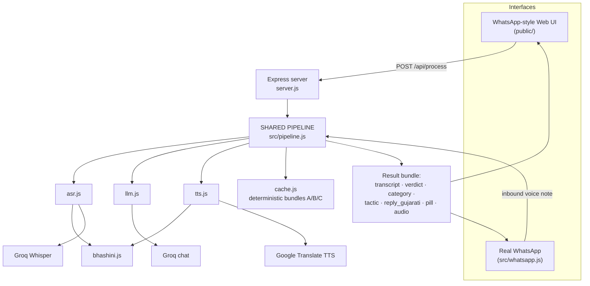
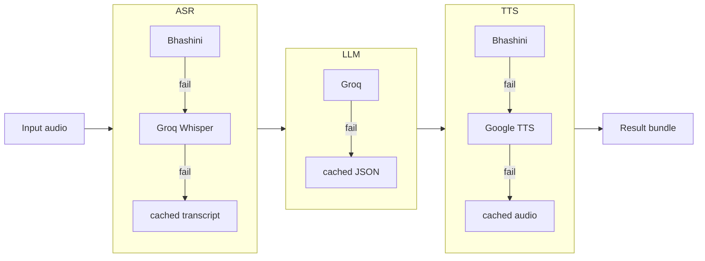
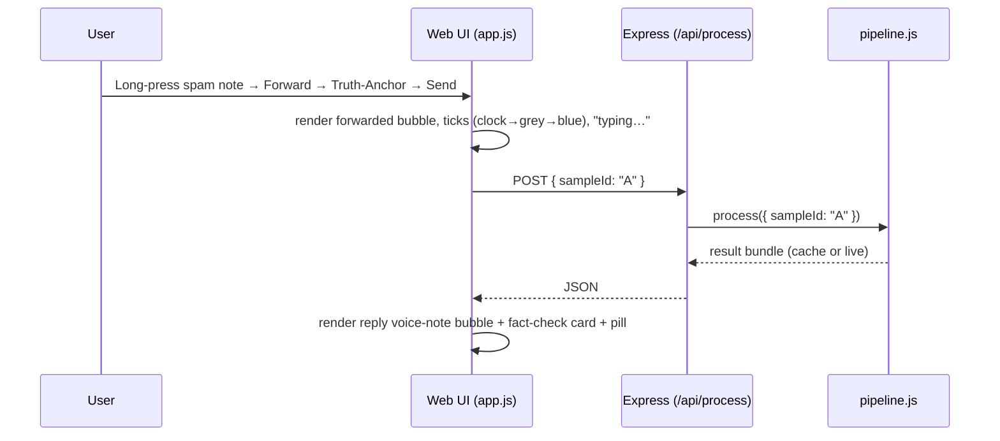
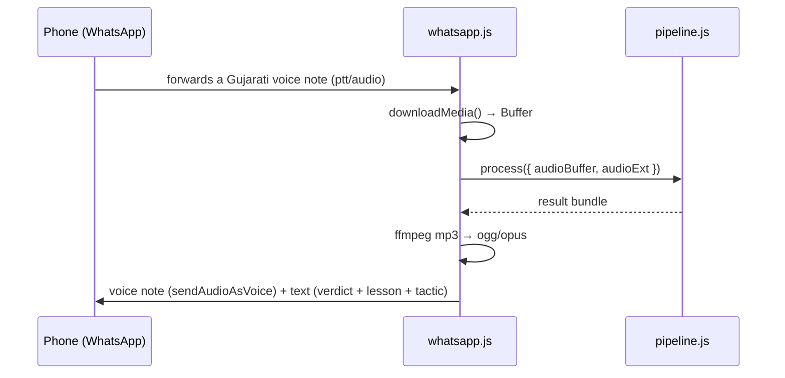

# Truth-Anchor — Technical & Architecture Documentation

> Vernacular (Gujarati) fact-checking for forwarded WhatsApp voice notes, with a
> media-literacy lesson that teaches the manipulation tactic (prebunking).
> Hackathon demo — single local project, two interfaces, one shared pipeline.

This document explains **what was used, how it's structured, the features, and how it actually
works**. For install/run steps see [`README.md`](./README.md); for the design rationale see
[`docs/superpowers/specs/2026-07-16-truth-anchor-design.md`](./docs/superpowers/specs/2026-07-16-truth-anchor-design.md).

---

## 1. The problem & the idea

Elderly, semi-literate users in rural Gujarat receive scams and health myths as **forwarded
WhatsApp voice notes** in their own language. Text fact-checkers don't help them: they can't read
English, and a verdict alone doesn't build resistance to the *next* scam.

**Truth-Anchor** takes a forwarded Gujarati voice note and replies with:

1. a **spoken Gujarati voice note** giving the verdict plainly, and
2. a **media-literacy lesson** — it *names the manipulation tactic* ("urgency + secrecy") so the
   user learns to spot the next one themselves. This is **prebunking**, not just debunking.

Two interfaces, one brain:

| Interface | Purpose |
|-----------|---------|
| **WhatsApp-style Web UI** | A faithful WhatsApp clone — the reliable, demo-safe surface for the pitch video. |
| **Real WhatsApp** (`whatsapp-web.js`) | A real forwarded voice note on a real phone triggers a real reply — the "it actually works" proof. |

Both call the **same pipeline module**. Neither knows the other exists.

---

## 2. Technology stack

| Layer | Choice | Why |
|-------|--------|-----|
| Runtime | **Node.js 20+** (ESM) | One language across UI, server, and scripts. |
| Web server | **Express** | Minimal; serves the UI + one JSON endpoint + static audio. |
| Speech-to-text (ASR) | **Groq Whisper** `whisper-large-v3` (`language=gu`) | Works today with just the Groq key; genuinely transcribes Gujarati. |
| Reasoning (LLM) | **Groq** `llama-3.3-70b-versatile` (JSON mode) | Fast, cheap, reliable structured output. |
| Text-to-speech (TTS) | **Google Translate TTS** (`tl=gu`, free, no key) | Real Gujarati audio with zero paid keys. |
| Indic pipeline (optional) | **Bhashini / ULCA** ASR + TTS | Government Indic stack; used first if a key is present. |
| Real WhatsApp | **whatsapp-web.js** (QR login) | Real number, real voice notes; no Twilio, no ngrok, no sandbox limit. |
| Audio conversion | **ffmpeg-static** + **fluent-ffmpeg** | Bundled ffmpeg (no system install) for mp3 ⇄ ogg/opus / wav. |
| Frontend | **Vanilla HTML / CSS / JS** | No framework — a pixel-accurate WhatsApp clone, 390px mobile. |
| Config | **dotenv** | All keys in `.env` (gitignored). |

**No database, no auth, no accounts, no build step.** Deliberately simple.

---

## 3. System architecture



The key architectural decision: **`src/pipeline.js` is the single entry point.** Both interfaces
call `process(...)` and render whatever comes back. All provider logic, fallbacks, and demo-safety
live behind that one function.

---

## 4. The shared pipeline (the core)

**File:** `src/pipeline.js` · **Entry:** `process({ sampleId?, audioPath?, audioBuffer?, audioExt? })`

Three steps, each isolated in its own module and independently swappable:

```
1. ASR  (src/asr.js)  — Gujarati speech → text
2. LLM  (src/llm.js)  — text → { verdict, category, tactic, reply_gujarati, confidence }
3. TTS  (src/tts.js)  — reply_gujarati → an mp3 voice note
```

### 4.1 The fallback ladder ("never breaks on camera")

Every external call is wrapped in a timeout (`API_TIMEOUT_MS`, default 8 s) and a try/catch.
Each step degrades independently:



For the **3 scripted scenarios (A/B/C)**, `DEMO_MODE=cache` (the default) short-circuits straight
to the deterministic cached bundle — instant, identical every take, filming-safe. `DEMO_MODE=live`
forces the real pipeline (with the ladder above as backup). **Mic-recorded / non-scripted input
always runs live.**

### 4.2 The result bundle (shared contract)

```jsonc
{
  "transcript":     "…gujarati…",
  "verdict":        "false | scam | unsure",
  "category":       "scam | health | claim | unsure",
  "tactic":         "…short tactic in gujarati…",
  "reply_gujarati": "…spoken reply (also the caption bubble)…",
  "confidence":     "high | medium | low",
  "subtitle_en":    "…~13px grey English gloss…",
  "pill":           { "kind": "scam|verified|unsure", "text": "…", "chip": "PIB Fact Check|null" },
  "replyAudioUrl":  "/media/replyA.mp3",
  "inputAudioUrl":  "/media/sampleA_input.mp3",
  "source":         "live | cache",
  "providers":      { "asr": "groq-whisper", "llm": "groq", "tts": "google" }  // live runs only
}
```

`subtitle_en` and `pill` are added by the **app layer** (`present.js` / `samples.js`), *not* the
LLM — so `prompt.txt` stays exactly as authored and the JSON schema never changes.

---

## 5. The reasoning logic (LLM)

**File:** `src/llm.js` · **Prompt:** `prompt.txt` (editable; `#` lines are stripped before sending)

The transcript is sent to Groq with `response_format: { type: 'json_object' }`. The model
classifies into one of three lanes and writes a warm, plain-spoken Gujarati reply:

| Category | What it means | How it's judged |
|----------|---------------|-----------------|
| **scam** | Novel fraud (fake emergency, prize, OTP/payment, impersonation) | Can't fact-check a novel event → detect **behavioural red flags**: urgency, secrecy, pressure to pay, OTP requests. |
| **health / claim** | A checkable claim (fake cure, dangerous remedy, myth) | Judge against public-health consensus; if false, say so + advise a doctor. |
| **unsure** | Can't responsibly judge | **Never guess** — honest deferral to a doctor / family / health worker. |

The reply always **names the tactic in plain words** (the literacy lesson) and, for scams, ends
with a **safe action** ("before sending money, call a family member"). The output is validated and
normalized in `llm.js` (`normalize()`), so a malformed response can't crash the pipeline.

> Design principle baked into the prompt: **"A confidently wrong answer is worse than none."**

---

## 6. Demo-safe caching

**Files:** `src/samples.js`, `src/cache.js`, `scripts/seed.js`

- **`samples.js`** is the single source of truth for the 3 scenarios: input Gujarati text, the
  canonical result JSON, and the English subtitle.
- **`scripts/seed.js`** (runs on first `npm start` if `cache/` is empty, or via `npm run seed`)
  synthesizes, for each scenario: the *input* voice note, the *reply* voice note, and the bundle
  JSON — using Bhashini TTS if a key exists, else Google TTS.
- **`cache.js`** builds a coherent bundle from `samples.js` + `present.js` (`buildBundle`), and
  can match an inbound audio buffer to a scenario by **SHA-256 content hash**
  (`matchSampleByAudio`) — so forwarding an exact seeded file gives a deterministic result.
  `fallbackBundle()` returns the honest "unsure" bundle when everything else fails.

Generated audio (`cache/*.mp3`, `*.ogg`, `*.json`) is **gitignored** — regenerable in one command.

---

## 7. Request lifecycle

### 7.1 Web UI — forwarding a spam voice note



### 7.2 Real WhatsApp



The webhook problem Twilio would have (ack-fast, ngrok, sandbox limits) doesn't exist here:
`whatsapp-web.js` holds a live WebSocket session, so replies are just async REST-style sends.

---

## 8. The WhatsApp-style Web UI

**Files:** `public/index.html`, `public/styles.css`, `public/app.js`, `public/wallpaper.svg`

A **framework-free, pixel-accurate WhatsApp clone** (Android, light theme, 390px). It's a small
single-page app with its own screen router and an in-memory "phone."

### 8.1 Screens & routing

```
┌ Chat list ────────────┐   tap a chat    ┌ Conversation ─────────┐
│ +91 98765 43210  🎤 1 │ ─────────────►  │ header (name/status)  │
│ +91 90178 22540  🎤 1 │                 │ messages (bubbles)    │
│ Truth-Anchor ✓        │ ◄───── back ─── │ input bar / mic       │
│ મમ્મી · ઘર પરિવાર      │                 └───────────────────────┘
└───────────────────────┘                          │ long-press
                                                    ▼
                          ┌ Selection bar ┐   ┌ "Forward to…" sheet ┐
                          │ ✕ 1 ↩ ★ 🗑 →  │ ─►│ Truth-Anchor ✓  ▢    │
                          └───────────────┘   │ મમ્મી · ઘર પરિવાર    │→ Send
                                              └─────────────────────┘
```

`app.js` holds a `CONV` object (the conversations: three unknown-number spam chats, Truth-Anchor,
mom, family group). `openList()` / `openChat(id)` swap screens; each conversation re-renders from
its `messages[]` array, so forwarded notes and replies **persist** across navigation.

### 8.2 Signature features

- **Real waveforms.** Each voice note fetches its audio, decodes it with the Web Audio API
  (`AudioContext.decodeAudioData`), computes 42 peak bars, and paints them on a `<canvas>`. A
  green **scrubber knob** rides the waveform; played bars fill teal in real time; click to seek.
  The audio **actually plays**.
- **The forward flow.** Long-press (touch) / right-click / press-and-hold (desktop) a message →
  WhatsApp **selection action bar** (reply/star/delete/**forward**) → the **"Forward to…" sheet**
  slides up with a contact list → select Truth-Anchor → **Send**. You can then long-press the
  reply and forward it onward to family (**share the correction**).
- **Tick progression.** Outgoing messages animate clock → single grey → double grey → **blue read
  ticks**, timed to feel real, while the header shows **"typing…"**.
- **Forwarded tags.** Spam notes show *"Forwarded many times"*; forwarded replies show
  *"Forwarded"* — the authentic double-arrow indicators.
- **Doodle wallpaper.** `wallpaper.svg` tiles the classic faint WhatsApp beige doodles behind the
  chat.
- **Verdict pills** (from `present.js`, shared with WhatsApp): amber scam pill naming the tactic,
  green "✓ verified" pill + grey "PIB Fact Check" chip for health/claim, neutral grey "not sure"
  pill (never a false verdict claim).
- **Unknown-number banner**, group author colors, status bar, "Today" divider, encryption note —
  the small details that sell it.

### 8.3 How the UI talks to the backend

Everything routes through **one call**: `POST /api/process`.
- Forwarding a scripted spam note → `{ sampleId: "A" | "B" | "C" }` (JSON body).
- Recording your own → `multipart/form-data` with the audio blob.
The response (the result bundle) drives the reply voice-note bubble + fact-check card.

---

## 9. Real WhatsApp integration

**File:** `src/whatsapp.js` (run with `npm run whatsapp`)

- QR-login via `whatsapp-web.js` `LocalAuth` (session stored in `.wwebjs_auth/`, gitignored).
- On an inbound `ptt`/`audio` message: `downloadMedia()` → buffer → **shared pipeline**.
- Replies with (a) the generated Gujarati voice note (converted to **ogg/opus** via ffmpeg,
  `sendAudioAsVoice`) and (b) a **text** message (`composeWhatsappText()`: reply + pill line +
  English gloss).
- Guards: ignores own messages, `status@broadcast`, and groups; sends a friendly hint for
  non-audio messages.
- **Caveat:** automating a personal WhatsApp account is against WhatsApp's ToS (small ban risk) —
  fine for a one-off demo; a production any-recipient sender needs the official WhatsApp Business
  Platform (post-hackathon, not built).

---

## 10. HTTP API

| Method | Path | Body | Returns |
|--------|------|------|---------|
| `POST` | `/api/process` | `{ sampleId }` **or** multipart `audio` file | the result bundle (§4.2) |
| `GET`  | `/api/health` | — | `{ ok, demoMode, caps }` |
| `GET`  | `/media/*` | — | generated audio (reply/input/`out-*`.mp3) |
| `GET`  | `/` and static | — | the web UI |

`server.js` uses `multer` (disk storage, extension inferred from MIME) for uploads and cleans them
up after processing.

---

## 11. File-by-file

```
server.js              Express: web UI + POST /api/process + /media + startup banner
prompt.txt             LLM system prompt (editable; # comments stripped)
src/
  pipeline.js          THE shared core — process(); the fallback ladder
  config.js            env + capability flags (caps.groq / caps.bhashini) + withTimeout()
  samples.js           the 3 scenarios: input text + canonical result + English subtitle
  cache.js             buildBundle(), matchSampleByAudio() (sha256), fallbackBundle()
  asr.js               Bhashini → Groq Whisper
  llm.js               Groq chat (JSON) + validate/normalize
  tts.js               Bhashini → Google TTS (chunk + concat mp3)
  bhashini.js          ULCA getModelsPipeline → compute (ASR + TTS)
  present.js           formatPill() + composeWhatsappText() (shared by UI + WhatsApp)
  audio.js             ffmpeg-static: mp3→ogg/opus, →wav16k, →mp3; temp helpers
  whatsapp.js          whatsapp-web.js client → shared pipeline
scripts/seed.js        generate cached input/reply audio + bundle JSON
public/
  index.html           two screens (list + chat) + forward sheet + selection bar
  styles.css           WhatsApp tokens (#ECE5DD/#DCF8C6/#075E54…) + components
  app.js               screen router, conversations, waveform, forward flow, ticks
  wallpaper.svg        the doodle background tile
cache/                 generated audio + JSON (gitignored)
```

---

## 12. Key design decisions

| Decision | Rationale |
|----------|-----------|
| **One shared pipeline** | The whole point: two interfaces, identical behaviour, zero duplicated logic. |
| **Groq for ASR *and* LLM** | A single free key makes the live path genuinely work today — real transcription + real reasoning. |
| **Google TTS fallback** | Real Gujarati voice output with **no paid key**, so the demo is bulletproof out of the box. |
| **whatsapp-web.js over Twilio** | No creds, no ngrok, no "joined numbers" sandbox limit; a real number works immediately. |
| **Deterministic cache + `DEMO_MODE`** | The 3 scripted scenarios can never break on camera, yet the live pipeline is one flag away. |
| **Vanilla front-end** | A convincing WhatsApp clone needs pixel control, not a component library. |
| **Presentation in the app layer** | Keeps `prompt.txt` verbatim and the LLM contract stable. |

---

## 13. Limitations & scope

- **Demo, not production.** No database, no auth, no accounts, no analytics, no arbitrary-input
  hardening.
- **WhatsApp** uses personal-number automation (ToS caveat). Production = WhatsApp Business
  Platform + Meta verification (not built).
- **TTS** default is Google Translate TTS (one voice, needs internet). Bhashini gives higher-quality
  Indic voices when a key is added.
- Built to make **the 3 scripted scenarios flawless and real-looking** on both interfaces — nothing
  more, by design.

---

## 14. End-to-end, in one paragraph

You open the app to your **WhatsApp chat list**. An unknown number has sent a **spam voice note**;
you open the chat, **long-press** it, and **Forward** it to **Truth-Anchor**. The web UI posts the
audio's scenario id to `/api/process`; the **shared pipeline** transcribes it (Groq Whisper),
classifies it and writes a plain Gujarati reply that *names the tactic* (Groq LLM), and synthesizes
that reply into a **voice note** (Google TTS) — falling back to a cached, deterministic bundle if
any step hiccups. Truth-Anchor's reply lands back in the chat as a **playable Gujarati voice note**
plus a **fact-check card** with a verdict pill and an English subtitle. You can then **forward that
reply on to your family** — spreading the correction. The exact same pipeline runs when a real
phone forwards a real voice note over **`whatsapp-web.js`**. That's Truth-Anchor.
